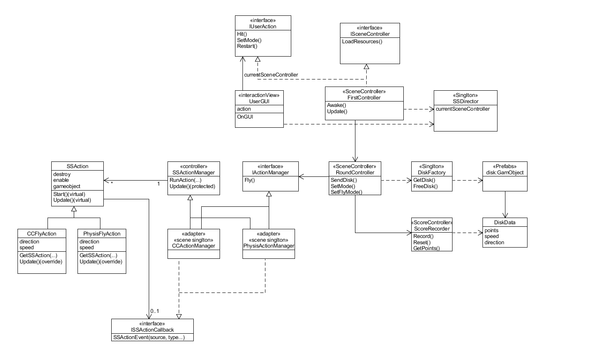

# UFO Game - Unity Project

## 项目概述

这是一个简单的 Unity UFO 游戏项目，旨在展示如何使用 Unity GUI 系统显示文本和按钮，控制 UFO 动作，并进行简单的用户交互。该游戏涉及得分、游戏模式选择和飞行模式的切换。

## UML图

参考了往届师兄改进版本的UML图




## 主要功能

- **显示文本**：通过 GUI 在屏幕上显示得分、消息和其他信息。
- **按钮功能**：提供多种按钮选项，包括重启、切换游戏模式、切换飞行模式等。
- **UFO 控制**：使用物理引擎和自定义动作控制 UFO 的运动轨迹。
- **界面布局**：界面布局支持响应式设计，可以动态调整位置，使 UI 元素根据屏幕大小进行适配。

## 关键代码

### `OnGUI` 方法

在 `OnGUI` 方法中，我们使用 Unity 的 `GUI.Label` 和 `GUI.Button` 来显示游戏信息和提供交互按钮。

```csharp
void OnGUI()
{
    // 小字体初始化
    GUIStyle style = new GUIStyle();
    style.normal.textColor = Color.white;
    style.fontSize = 30;

    // 大字体初始化
    GUIStyle bigStyle = new GUIStyle();
    bigStyle.normal.textColor = Color.white;
    bigStyle.fontSize = 50;

    // 获取屏幕宽度和高度
    float screenWidth = Screen.width;
    float screenHeight = Screen.height;

    // 计算元素的偏移，使其对齐到右侧的四分之一处
    float rightQuarterX = screenWidth * 0.75f; // 屏幕右侧四分之一位置
    float elementWidth = 200f; // UI 元素的宽度
    float elementHeight = 50f; // UI 元素的高度

    // 显示 "Hit UFO" 标签，放在屏幕右侧四分之一处
    GUI.Label(new Rect(rightQuarterX - elementWidth / 2, screenHeight / 4 - 100, elementWidth, elementHeight), "Hit UFO", bigStyle);

    // 显示得分，放在屏幕右侧四分之一处
    GUI.Label(new Rect(rightQuarterX - elementWidth / 2, screenHeight / 4, elementWidth, elementHeight), "Points: " + points, style);

    // 显示游戏消息，放在屏幕右侧四分之一处
    GUI.Label(new Rect(rightQuarterX - elementWidth / 2, screenHeight / 4 + 50, elementWidth, elementHeight), gameMessage, style);

    // 显示按钮，放在屏幕右侧四分之一处
    if (GUI.Button(new Rect(rightQuarterX - elementWidth / 2, screenHeight / 2 - 100, elementWidth, 40), "Restart"))
    {
        userAction.Restart();
    }
    if (GUI.Button(new Rect(rightQuarterX - elementWidth / 2, screenHeight / 2 - 50, elementWidth, 40), "Normal Mode"))
    {
        userAction.SetMode(false);
    }
    if (GUI.Button(new Rect(rightQuarterX - elementWidth / 2, screenHeight / 2, elementWidth, 40), "Infinite Mode"))
    {
        userAction.SetMode(true);
    }
    if (GUI.Button(new Rect(rightQuarterX - elementWidth / 2, screenHeight / 2 + 50, elementWidth, 40), "Kinematics"))
    {
        userAction.SetFlyMode(false);
    }
    if (GUI.Button(new Rect(rightQuarterX - elementWidth / 2, screenHeight / 2 + 100, elementWidth, 40), "Physis"))
    {
        userAction.SetFlyMode(true);
    }

    // 检测鼠标点击事件
    if (Input.GetButtonDown("Fire1"))
    {
        userAction.Hit(Input.mousePosition);
    }
}
```

### UFO 控制

通过自定义的 `CCFlyAction` 脚本，我们控制 UFO 的飞行轨迹，使用了重力和运动速度控制 UFO 在 X 和 Y 轴上的运动。

```csharp
void Update()
{
    time += Time.deltaTime;
    // y 方向的重力
    transform.Translate(Vector3.down * gravity * time * Time.deltaTime);
    // x 方向的速度
    transform.Translate(direction * speed * Time.deltaTime);

    if (this.transform.position.y < -3)
    {
        this.destroy = true;
        this.enable = false;
        this.callback.SSActionEvent(this);
    }
}
```

### SSActionManager

`SSActionManager` 脚本负责管理和更新所有的动作，并处理动作完成后的事件。

```csharp
void Update()
{
    // 保存就绪的动作到哈希表
    foreach (SSAction action in ready)
    {
        actions[action.GetInstanceID()] = action;
    }
    ready.Clear();

    // 启动并更新哈希表中的动作
    foreach(KeyValuePair<int, SSAction> k in actions)
    {
        SSAction ac = k.Value;
        if (ac.destroy)
        {
            delete.Add(ac.GetInstanceID());
        }
        else if(ac.enable)
        {
            ac.Update();
        }
    }

    // 删除已完成的动作
    foreach(int k in delete)
    {
        if (actions.ContainsKey(k))
        {
            SSAction ac = actions[k];
            actions.Remove(k);
            Destroy(ac.gameObject);
        }
    }

    delete.Clear();
}
```
以下是今天的内容总结，以富文本格式呈现：

---

### **单例模式的实现**

**单例模式**确保某个类只有一个实例，并提供一个全局访问点。为了实现单例模式，你需要：

- **创建一个通用的单例类**，可以为任何类型提供单例实例。
  
  ```csharp
  public class Singleton<T> where T : class, new()
  {
      private static T instance;

      private Singleton() { }

      public static T Instance
      {
          get
          {
              if (instance == null)
              {
                  instance = new T();
              }
              return instance;
          }
      }
  }
  ```

- **使用单例类**：通过 `Singleton<T>.Instance` 获取单例实例。

---

###  实现 `IActionManager` 接口与单例结合

当你需要实现接口 `IActionManager` 并且使用单例时，可以这样操作：

- **实现接口**，例如 `Fly` 方法。
- **继承单例类**，确保 `CCActionManager` 只有一个实例。

示例代码：

```csharp
public interface IActionManager
{
    void Fly(GameObject ufo, float speed, Vector3 direction);
}

public class CCActionManager : Singleton<CCActionManager>, IActionManager
{
    public void Fly(GameObject ufo, float speed, Vector3 direction)
    {
        // 飞行逻辑实现
        Debug.Log("Flying UFO with speed: " + speed);
        ufo.transform.Translate(direction * speed * Time.deltaTime);
    }
}
```

---

### **使用单例实例**

在其他类中，你可以通过 `Singleton<CCActionManager>.Instance` 来访问单例实例，并调用其方法：

```csharp
public class SomeOtherClass : MonoBehaviour
{
    private void Start()
    {
        // 获取CCActionManager的单例实例
        IActionManager actionManager = Singleton<CCActionManager>.Instance;

        // 使用接口方法
        GameObject ufo = new GameObject(); // 假设这是一个UFO游戏对象
        actionManager.Fly(ufo, 10f, Vector3.forward); // 假设飞行的速度是10，方向是前方
    }
}
```

---

### **总结**

1. **单例模式**：确保一个类只有一个实例，并提供全局访问。
2. **接口实现与单例结合**：实现接口并继承单例类，以确保接口方法可以通过单例实例访问。
3. **通过 `Singleton<T>.Instance` 使用单例**：无需担心实例化，直接通过单例访问类的功能。

---

###  修改全局重力（也就是做弧线运动的原因）
Unity 使用 `Physics.gravity` 来设置全局重力。在默认情况下，Unity 的重力是 `Vector3(0, -9.81, 0)`，表示垂直向下的标准重力。你可以通过修改 `Physics.gravity` 来改变全局的重力方向和强度。

**示例代码**：

```csharp
// 设置全局重力为垂直向下，强度为 9.81
Physics.gravity = new Vector3(0, -9.81f, 0);

// 修改为自定义的重力方向和强度
Physics.gravity = new Vector3(0, -15f, 0);  // 设置更强的垂直重力
```
这段代码实现了一个 **飞碟工厂模式**，用于管理游戏中的飞碟对象的创建和回收。工厂模式的目的是封装对象的创建过程，并提供一个集中管理的方式。下面是对 `DiskFactory` 类的详细总结：

###  **类的成员变量**

- **`disk_Prefab`**：飞碟的预制体，用于实例化新的飞碟对象。
- **`used`**：一个列表，存储正在被使用的飞碟数据（`DiskData`）。这些飞碟当前处于活动状态。
- **`free`**：一个列表，存储空闲的飞碟数据（`DiskData`）。这些飞碟已经被回收，处于非活动状态。

###  **`Start` 方法**

- **初始化**：`used` 和 `free` 列表被初始化为空的列表。
- **加载预制体**：从资源文件夹加载飞碟预制体（`disk_Prefab`），并将其设置为初始的非激活状态（`SetActive(false)`）。

### 3**`GetDisk` 方法**

这个方法根据传入的 `round`（轮次）值来返回一个飞碟对象。其具体逻辑如下：

- **飞碟的获取**：
  - 如果有空闲的飞碟（`free.Count > 0`），就从空闲列表中取出一个飞碟对象，并将其从空闲列表中移除。
  - 如果没有空闲的飞碟，就通过预制体创建一个新的飞碟对象，并为它添加一个 `DiskData` 组件。

- **飞碟属性的设置**：
  - 使用传入的 `round` 值来设置飞碟的属性，包括 `points`（分数）、`speed`（速度）、`direction`（飞行方向），以及飞碟的颜色。
  - 飞碟的属性与 `round` 的关系：
    - 根据 `round` 和随机生成的 `level` 值决定飞碟的属性。
    - **红色飞碟**（`points = 1`，`speed = 4.0f`）: 当 `level` 小于 4。
    - **绿色飞碟**（`points = 2`，`speed = 6.0f`）: 当 `level` 在 4 和 7 之间。
    - **蓝色飞碟**（`points = 3`，`speed = 8.0f`）: 当 `level` 大于 7。

- **飞碟的添加**：将飞碟添加到 `used` 列表中，表示它正在使用中。

###  **`FreeDisk` 方法**

该方法用于回收飞碟并将其重新放入空闲列表中，具体步骤如下：

- 遍历 `used` 列表，找到与传入的 `disk` 对象匹配的飞碟。
- 一旦找到该飞碟，将其设置为非激活状态（`SetActive(false)`），并将其添加到 `free` 列表中。
- 从 `used` 列表中移除该飞碟，表示它不再处于使用状态。

###  **部分总结**

- **工厂模式**：这个类实现了一个简单的工厂模式，主要用于管理飞碟对象的创建和回收。通过 `GetDisk` 方法来创建新的飞碟，或者复用已存在的飞碟。通过 `FreeDisk` 方法来回收不再使用的飞碟。
- **资源管理**：使用了两个列表 `used` 和 `free` 来分别管理正在使用和空闲的飞碟数据，有效避免了重复创建飞碟对象，从而提高了性能。
- **动态属性设置**：通过轮次 (`round`) 和随机生成的值来设置飞碟的属性，使得每个飞碟的行为在游戏中都可能有所不同，增加了游戏的趣味性。

这种实现方式使得飞碟对象的管理更加高效，避免了频繁的对象创建和销毁，也符合工厂模式的设计思想。
## 游戏模式

- **普通模式**：玩家击中 UFO 进行得分。
- **无限模式**：随着时间推移，UFO 会不断出现并挑战玩家。
- **运动学模式和物理模式**：控制 UFO 的飞行方式，使用不同的物理规则。

```csharp
using System.Collections;
using System.Collections.Generic;
using UnityEngine;

public class ScoreRecorder
{
    int points;                 //游戏当前分数

    public ScoreRecorder()
    {
        points = 0;
    }

    public void Record(DiskData disk)
    {
        points += disk.points;
    }

    public int GetPoints()
    {
        return points;
    }

    public void Reset()
    {
        points = 0;
    }
}
```

`ScoreRecorder` 类是游戏得分管理的核心，主要功能是记录、更新、获取和重置游戏分数。以下是对其必要性的总结：

### 分数管理
`ScoreRecorder` 类保存当前的得分，并通过 `Record` 方法根据飞碟的 `points` 更新分数。每当飞碟被击中时，分数就会增加，`GetPoints` 方法可以获取当前分数，`Reset` 方法则用于在需要时重置分数。

### 模块化和解耦
`ScoreRecorder` 类将得分的管理独立出来，遵循了单一职责原则（SRP）。它只负责记录和管理分数，其他游戏逻辑不需要关心分数的细节，从而增强了代码的可读性和维护性。这种解耦也便于将来对得分系统进行扩展或修改，比如增加奖励或多种得分方式时，可以仅修改 `ScoreRecorder` 类。

### 游戏流程控制
得分通过 `Record` 方法积累，飞碟的属性 `points` 会直接影响分数。`Reset` 方法可以重置分数，通常在游戏重新开始时调用。通过这种设计，得分管理与游戏的其他逻辑分离，使得得分系统在游戏流程中更加灵活。

### 方便测试
`ScoreRecorder` 类功能简单，易于单元测试。可以单独测试 `Record` 方法的分数增加是否正确，或测试 `Reset` 方法是否能正确清零分数。这样即

## 游戏控制

- **重启游戏**：点击重启按钮重新开始游戏。
- **切换模式**：切换普通模式和无限模式。
- **切换飞行模式**：选择 UFO 飞行的运动学或物理模式。

## 运行与测试

1. 打开 Unity 项目。
2. 确保所有脚本和资源已正确导入。
3. 点击播放按钮运行游戏并进行测试。


## 视频链接

https://www.bilibili.com/video/BV1bnUeYMEP3/
